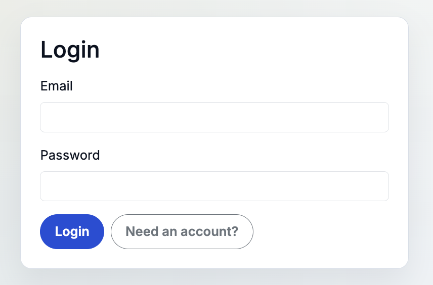
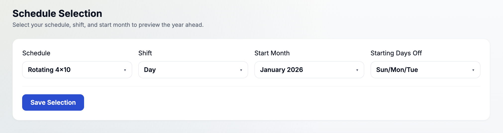
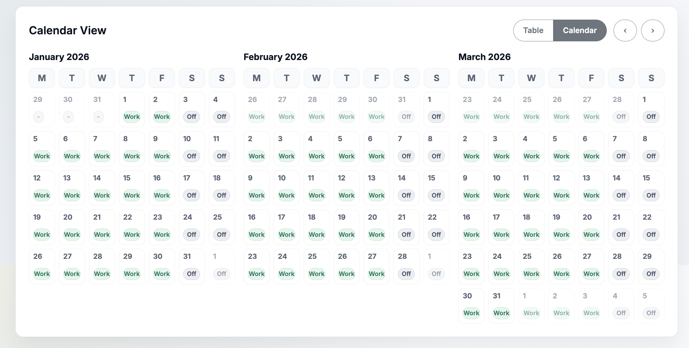

# DaysOff

DaysOff is a small ASP.NET Core (Blazor Server) app for previewing rotating work schedules and visualizing your days off across the year.

## Features

- Pick a schedule, shift, start month, and starting days off
- Preview the year ahead in **table** or **calendar** modes
- Sign in/out via cookie auth (`/login`, `/logout`)
- SQLite-backed storage (defaults to `daysoff.db`)

## Screenshots

### Login



### Schedule selection



### Year preview


### Calendar view



## Quickstart

### Prerequisites

- .NET SDK 9

### Run

```bash
dotnet restore
dotnet run
```

### Database

By default the app uses SQLite at `daysoff.db`. You can override via `ConnectionStrings:DaysOff` (for example in `appsettings.Development.json` or via environment variables).
